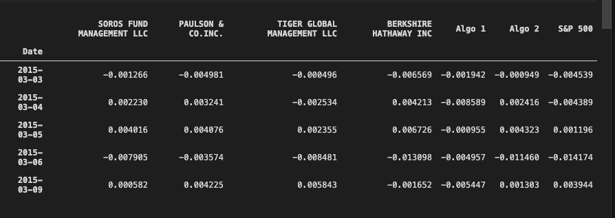
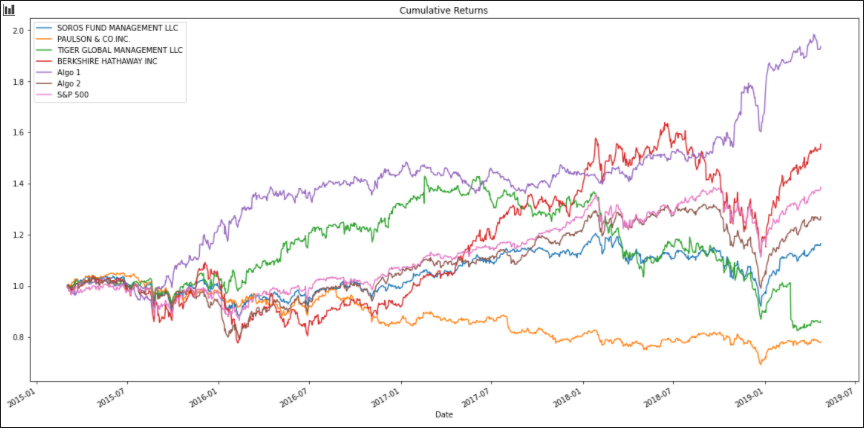
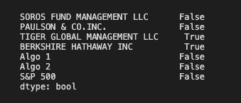
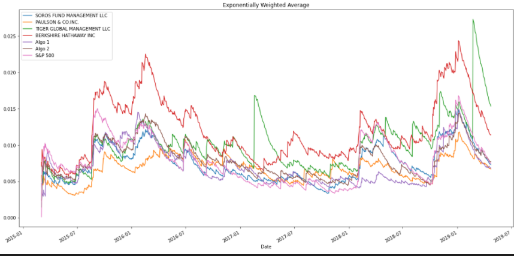
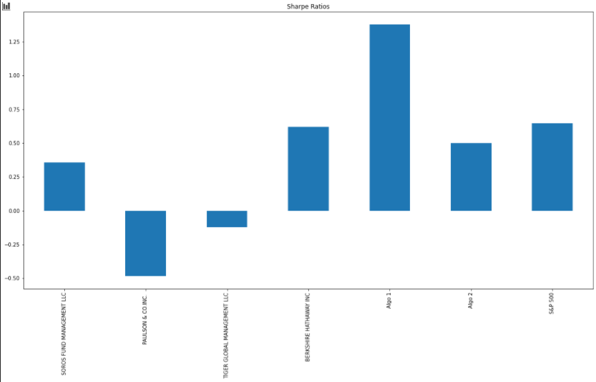
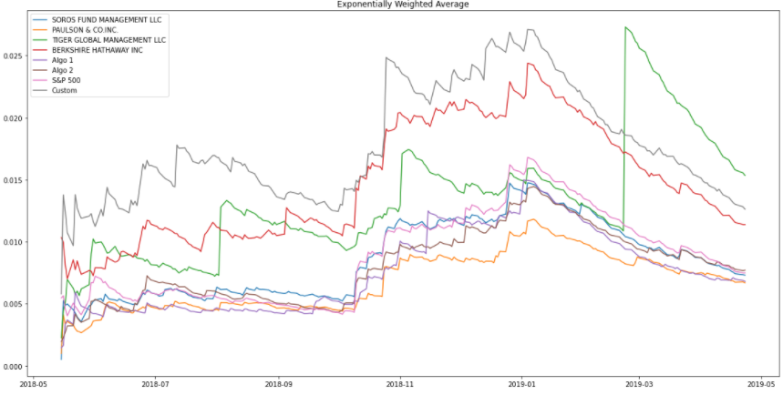
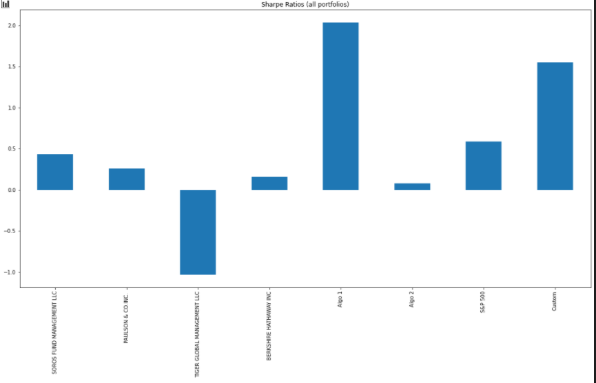

[^1]

# Whale Analysis

Asif Meghani

Oct 10, 2020

---

## Overview

Whales are one of the biggest mammals on Earth. They evolved from land mammals... This is the wrong "whale". This analysis focuses on the "financial whales". In finance a "whale" is a market manipulator. That is to say that they are so big (in terms of assets) that they can affect the price of stock by buying large amounts to make it increase in value or sell large amounts to make it decrease in value. This analysis will focus on the returns and risk compared to the index S&P 500. This analysis will also introduce 2 algorithms and a custom portfolio into the mix for comparative analysis.

### Whales compared

| Name of the Fund     |
|----------------------|
|Soros Fund Management LLC |
|Paulson & Co. INC.        |
|Tiger Global Management LLC|
|Berkshire Hathaway INC.   |

### Algorithms

|Algorithms   |
|-------------|
|Algo 1   |
|Algo 2   |

### Custom Portfolio

|Stock     |Ticker   |
|----------|---------|
|Adidas    |ADDYY    |
|Spirit    |SAVE     |
|Shopify   |SHOP     |

---

[^2]

## Analysis

---

The code imports the csv files from the resources folder and cleans the data imported data to drop any rows with missing data and join the whale returns dataframe and the algo returns dataframe together.

Next it will look at the returns and the cumulative returns of these funds and algorithms with S&P 500 as the benchmark, to gauge the performance of these funds. From this analysis Berkshire Hathaway INC. and Algo 1 have outperformed the benckmark.

After that, it will take a look at the risk involved in these funds and calculate the rolling averages for the returns and determine which of these is riskier than the S&P 500. True = Riskier

Next, it will go through the rolling averages to identify long term trends and to smooth the price data over a specific time. The graph below shows the 21 day exponentially weighted average of all the portfolios. Exponentially weighted average is used to give more importance to more recent data.

And finally it will look at the sharpe ratio of the portfolios. A sharpe ratio is used to understand return on investment compared to its risk.

Next it will add a custom portfolio into the mix and rerun all the metrics to compare the custom portfolio to the previous funds and algorithms.

Exponentially weighted average

Sharpe Ratio

## Results

---

What is learned from this analysis?

